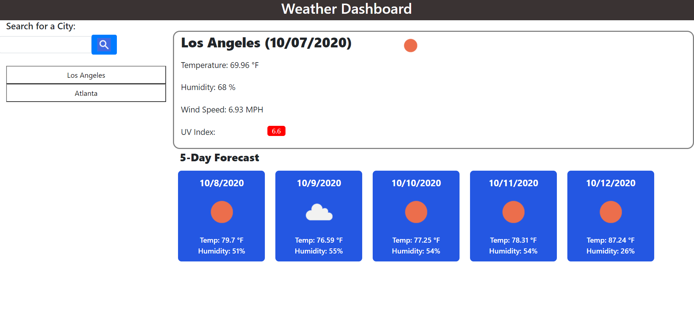

# weather-dashboard

## Description 

This project designed a weather dashboard that allows the user to see current weather conditions for a particular city as well as a 5 day weather forecast for that given city. The website utilizes AJAX to retrieve the openweathermap.org API and uses client-side storage to save search results for future re-use.

This project utilized jQuery to dynamically create and manipulate elements based on the object returned from the weather API. Array manipulation was used to move the most recent searched city to the top of the list, similar to a LRU-cache. 

Event delegation is also implemented on the search history list and for the form submission. Object traversal was used to capture corresponding weather icon images for more user-friendly visualizations.

## Table of Contents 

* [Installation](#installation)
* [Usage](#usage)
* [Credits](#credits)
* [License](#license)

## Installation

Here is the link to the webpage:

https://jgarcia60.github.io/weather-dashboard 

To install the project files, you can clone the "weather-dashboard" repository which contains the necessary JavaScript, html, and CSS files at https://github.com/jgarcia60/weather-dashboard by clicking the green drop down "Code" and cloning the repo with an SSH key.  

## Usage 

You may use this code as your own weather dashboard, or as a tool to learn about using AJAX to implement API's, how to navigate through JavaScript objects, and how to use jQuery for dynamic HTML creation/manipulation.

This is what it looks like:

## Credits

All HTML, CSS, and JS files, edits, additions, and revisions were done by Jonathan Garcia (https://github.com/jgarcia60/weather-dashboard). 

## License

MIT License

Copyright (c) [2020] [Jonathan Garcia]

Permission is hereby granted, free of charge, to any person obtaining a copy
of this software and associated documentation files (the "Software"), to deal
in the Software without restriction, including without limitation the rights
to use, copy, modify, merge, publish, distribute, sublicense, and/or sell
copies of the Software, and to permit persons to whom the Software is
furnished to do so, subject to the following conditions:
The above copyright notice and this permission notice shall be included in all
copies or substantial portions of the Software.

THE SOFTWARE IS PROVIDED "AS IS", WITHOUT WARRANTY OF ANY KIND, EXPRESS OR
IMPLIED, INCLUDING BUT NOT LIMITED TO THE WARRANTIES OF MERCHANTABILITY,
FITNESS FOR A PARTICULAR PURPOSE AND NONINFRINGEMENT. IN NO EVENT SHALL THE
AUTHORS OR COPYRIGHT HOLDERS BE LIABLE FOR ANY CLAIM, DAMAGES OR OTHER
LIABILITY, WHETHER IN AN ACTION OF CONTRACT, TORT OR OTHERWISE, ARISING FROM,
OUT OF OR IN CONNECTION WITH THE SOFTWARE OR THE USE OR OTHER DEALINGS IN THE
SOFTWARE.

---